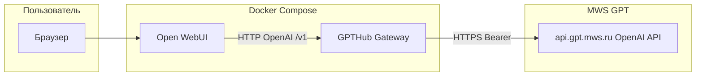

# Архитектура GPTHub

## Компоненты

- **Open WebUI** — интерфейс чата, история диалогов, выбор модели, загрузка файлов и мультимодальные сообщения в формате, совместимом с OpenAI.
- **GPTHub Gateway** — единая точка входа для MWS: проксирует `GET /v1/models`, `POST /v1/chat/completions`, `POST /v1/embeddings`, `POST /v1/images/generations`, `POST /v1/audio/transcriptions` и добавляет:
  - **IntentRouter** — модель `gpthub-auto`: выбор сценария (текст, VLM, генерация изображения по промпту, контекст поиска/ссылок).
  - **MemoryService** — SQLite + векторный отбор фрагментов через эмбеддинги `bge-m3` (MWS `POST /v1/embeddings`).
  - **RAG** — чанки длинного текста в сообщении пользователя, те же эмбеддинги, выборка по косинусной близости к запросу.
  - **WebSearch / URLFetch** — DuckDuckGo text search и извлечение текста страницы (trafilatura), результаты подмешиваются в system-контекст; итоговый ответ формирует только LLM через MWS.

Данные памяти и RAG хранятся в volume `/data` контейнера шлюза.

## Сценарии пользователя

1. **Текстовый диалог** — модель по умолчанию (`DEFAULT_LLM`) или выбранная вручную.
2. **Картинка в сообщении** — автоматически выбирается vision-модель (`VISION_MODEL`).
3. **«Нарисуй / сгенерируй изображение»** — вызов `images/generations`, ответ с markdown-изображением.
4. **Аудио** — клиент отправляет запрос на `audio/transcriptions` (прокси на MWS Whisper); дальше тот же тред с текстовой моделью.
5. **Длинный текст / документ** — фрагменты индексируются в RAG; ответы с опорой на извлечённые чанки.
6. **«Найди в интернете»** — результаты DDG в контексте; **ссылка в сообщении** — текст страницы в контексте.
7. **Память** — после ответов ассистента пары «вопрос–ответ» сохраняются и подмешиваются при релевантности запросу.

## Внешние зависимости

- **MWS GPT** — обязательный доступ по API-ключу; список моделей берётся из `GET /v1/models`.
- Сеть для DuckDuckGo и HTTP-загрузки URL.

## Безопасность

Ключ `MWS_API_KEY` только через переменные окружения и не хранится в репозитории.
