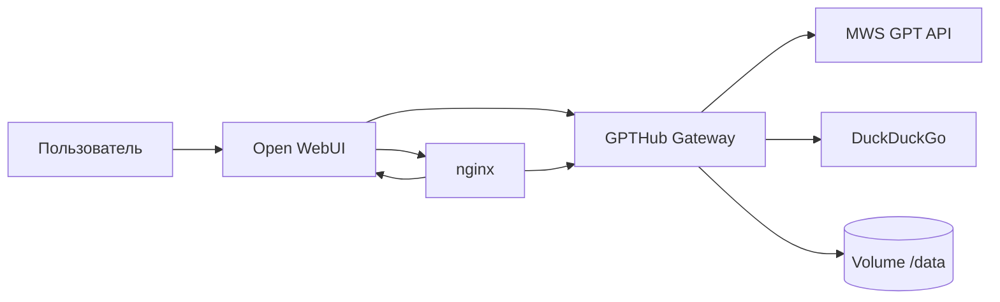

# gena 2.0 — обзор для демо и жюри

Единая точка входа: **Open WebUI** → **GPTHub Gateway** (`/v1`) → **MWS GPT** (модели, картинки, эмбеддинги, ASR по настройкам).

## Сценарии (авто-модель `gpthub-auto`)

| Режим | Триггер (упрощённо) | Что происходит |
|--------|----------------------|----------------|
| Презентация | «презентация», «слайды» | Веб-поиск → LLM (JSON слайдов) → картинки веб/нейро → **PPTX** + **JSON** рядом |
| Deep Research | «глубокое исследование» и т.п. | Несколько DDG-запросов → выборка страниц → длинный отчёт (стрим) |
| Музыка | «сгенерируй mp3 / мелодию…» | LLM ноты → синус → **MP3** в `/static/music/` |
| Картинка | «нарисуй», «сгенерируй …» (не код/mp3) | Улучшение промпта → **images/generations** → ссылка/static |
| Обычный чат | всё остальное | Роутер **gena** → выбор модели + память + RAG + веб по триггерам |

Ручной выбор модели в UI отключает авто-перехваты (кроме согласованного с условиями конкурса поведения).

## Архитектура (упрощённо)

Статика презентаций/музыки/картинок: **`/static/...`** (в nginx прокси на порт шлюза).

## Надёжность и UX (реализовано в коде)

- Повторы запросов к MWS при **429 / 5xx / таймауте** (`GPTHUB_MWS_HTTP_RETRIES`).
- Кэш **веб-поиска** DDG по запросу (`GPTHUB_WEB_SEARCH_CACHE_TTL_SEC`).
- Лимит размера тела **`/v1/chat/completions`** (`GPTHUB_MAX_CHAT_PAYLOAD_CHARS`, по умолчанию 2M символов JSON — одно фото в base64 из UI часто ~1–1.5M; при 413 поднимите переменную).
- Логи: **X-Request-ID**, время ответа HTTP, лог перехватов gena (presentation / deep_research / music / image).
- Сообщения об ошибках в стримах перехватов — человекочитаемые (таймаут, 429, 5xx).

## Переменные окружения (фрагмент)

См. корень репозитория `.env.example`; для шлюза дополнительно:

- `GPTHUB_MWS_HTTP_RETRIES`, `GPTHUB_MWS_RETRY_BACKOFF_SEC`
- `GPTHUB_WEB_SEARCH_CACHE_TTL_SEC`, `GPTHUB_WEB_SEARCH_CACHE_MAX_ENTRIES`
- `GPTHUB_MAX_CHAT_PAYLOAD_CHARS`, `GPTHUB_MAX_PRESENTATION_SLIDES`
- `GPTHUB_PUBLIC_BASE_URL` — публичные ссылки на `/static/...` за прокси
